# Pranklin

A high-performance perpetual futures trading engine built in Rust, designed for speed, reliability, and scalability.

## 🚀 Performance

- **330K+ TPS**: Peak transaction throughput with order matching
- **Sub-microsecond** state operations (386ns balance reads/writes)
- **Efficient matching**: 1.2ms to match 100 orders

## 🏗️ Architecture

```mermaid
graph TB
    subgraph Application["🌐 Application Layer"]
        RPC[JSON-RPC Server]
        GRPC[gRPC Server]
        WS[WebSocket Server]
    end

    subgraph Execution["⚡ Execution Layer"]
        Mempool[Transaction Mempool<br/>Nonce Ordering]
        Executor[TX Executor]
    end

    subgraph Engine["🎯 Engine Layer"]
        Orderbook[Orderbook Manager<br/>Price-Time Priority]
        Position[Position Manager<br/>PnL Tracking]
        Risk[Risk Manager<br/>Margin Checks]
        Funding[Funding Rate Calculator]
        Liquidation[Liquidation Engine]
    end

    subgraph State["💾 State Layer"]
        StateManager[State Manager<br/>JMT + In-Memory]
        RocksDB[(RocksDB<br/>Persistence)]
        Snapshot[Snapshot Exporter<br/>S3/GCS]
    end

    RPC --> Mempool
    GRPC --> Executor
    WS -.-> Engine

    Mempool --> Executor
    Executor --> Orderbook
    Executor --> Position
    Executor --> Risk

    Orderbook --> StateManager
    Position --> StateManager
    Risk --> StateManager
    Funding --> StateManager
    Liquidation --> StateManager

    StateManager --> RocksDB
    StateManager --> Snapshot

    classDef appLayer fill:#e1f5ff,stroke:#01579b,stroke-width:2px
    classDef execLayer fill:#fff9c4,stroke:#f57f17,stroke-width:2px
    classDef engineLayer fill:#f3e5f5,stroke:#4a148c,stroke-width:2px
    classDef stateLayer fill:#e8f5e9,stroke:#1b5e20,stroke-width:2px

    class RPC,GRPC,WS appLayer
    class Mempool,Executor execLayer
    class Orderbook,Position,Risk,Funding,Liquidation engineLayer
    class StateManager,RocksDB,Snapshot stateLayer
```



## 📦 Crates

| Crate               | Description                                                |
| ------------------- | ---------------------------------------------------------- |
| `pranklin-app`      | Main application binary with server orchestration          |
| `pranklin-engine`   | Core trading engine with orderbook and position management |
| `pranklin-exec`     | Transaction executor with gRPC interface                   |
| `pranklin-state`    | State management with RocksDB persistence                  |
| `pranklin-tx`       | Transaction types and validation                           |
| `pranklin-rpc`      | JSON-RPC HTTP API server                                   |
| `pranklin-mempool`  | Transaction mempool with nonce ordering                    |
| `pranklin-auth`     | EIP-712 signature verification and agent system            |
| `pranklin-types`    | Shared type definitions                                    |
| `pranklin-macros`   | Procedural macros for serialization                        |
| `pranklin-loadtest` | Load testing and benchmarking tools                        |

## 🔧 Building

### Prerequisites

- Rust 1.75+ (nightly recommended)
- protoc (Protocol Buffers compiler)
- RocksDB (optional, for persistence)

### Build

```bash
# Build all crates
cargo build --release

# Run tests
cargo test --workspace

# Run benchmarks
cargo bench --workspace
```

## 🧪 Testing

```bash
# Unit tests
cargo test --lib --workspace

# Integration tests
cargo test --test '*' --workspace

# Specific test suites
cargo test -p pranklin-engine --test integration_tests
cargo test -p pranklin-engine --test security_tests
cargo test -p pranklin-engine --test recovery_tests
```

## 📊 Benchmarks

```bash
# Run all benchmarks
cargo bench --workspace

# Engine-specific benchmarks
cargo bench -p pranklin-engine

# View results
open target/criterion/report/index.html
```

## 🚦 Running

### RPC Server

```bash
cargo run --bin pranklin-app --release -- \
  --rpc-host 127.0.0.1 \
  --rpc-port 3000 \
  --grpc-host 127.0.0.1 \
  --grpc-port 50051
```

### Load Testing

```bash
cd crates/loadtest
cargo run --release -- \
  --duration 60 \
  --tps 1000 \
  --scenario mixed
```

## 🔑 Key Features

### Trading Engine

- **Orderbook matching** with price-time priority
- **Position management** with PnL tracking
- **Funding rate** calculations
- **Liquidation engine** with insurance fund
- **Risk management** with margin requirements

### State Management

- **In-memory state** with Jellyfish Merkle Tree
- **RocksDB persistence** with snapshot support
- **Cloud backup** to S3/GCS
- **State recovery** from checkpoints

### Transaction Processing

- **EIP-712 signatures** for transaction authentication
- **Nonce-based ordering** in mempool
- **Agent system** for delegated trading

### API

- **JSON-RPC** HTTP API
- **gRPC** for node communication
- **WebSocket** for real-time updates
- **Prometheus metrics** for monitoring

## 🏃 Development

### Code Style

```bash
# Format code
cargo fmt --all

# Run linter
cargo clippy --workspace --all-targets
```

### Project Structure

```
pranklin/
├── crates/           # Rust workspace crates
├── data/             # Runtime data and configuration
├── docs/             # Documentation
├── sequencer/        # Go-based sequencer (experimental)
└── target/           # Build artifacts
```

## 📈 Performance Tuning

### Recommended Configuration

- **Block size**: 500-1000 transactions for optimal throughput
- **Mempool size**: 10,000+ transactions
- **Worker threads**: 4-8 for parallel execution
- **RocksDB cache**: 256MB-1GB depending on state size

### Monitoring

The system exposes Prometheus metrics at `/metrics`:

- Transaction throughput (TPS)
- Order placement/cancellation rates
- Position open/close rates
- Liquidation events
- State commit duration
- Mempool size

## 🛡️ Security

- **EIP-712 typed signatures** for all transactions
- **Nonce replay protection**
- **Agent permissions** with granular control
- **Risk checks** before order execution
- **Liquidation safeguards** to protect system solvency

## 📄 License

See LICENSE file for details.

## 🤝 Contributing

Contributions are welcome! Please ensure:

- All tests pass (`cargo test --workspace`)
- Code is formatted (`cargo fmt --all`)
- No clippy warnings (`cargo clippy --workspace`)
- Benchmarks show no regressions

## 🔗 Related Projects

- [Jellyfish Merkle Tree](https://github.com/penumbra-zone/jmt) - Sparse Merkle tree implementation
- [alloy-rs](https://github.com/alloy-rs) - Ethereum types and utilities
- [tonic](https://github.com/hyperium/tonic) - gRPC implementation

---

Built with ❤️ in Rust
